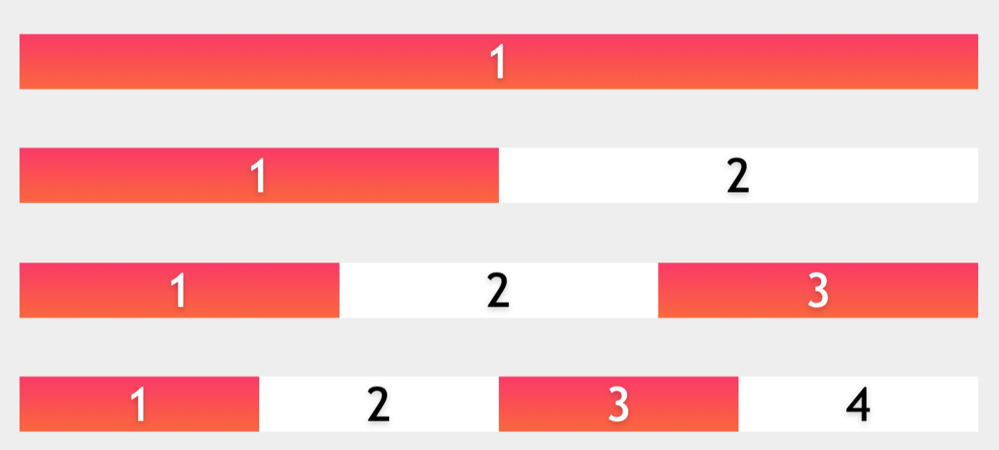

# Selectors

## Specificity
* 3 columns for specificty (1-2-3)
  * id selector: `1-0-0`
  * class selector (attribute + pseudo class): `0-1-0`
  * element selector: `0-0-1`
  * global selector `*` has no value

* specificity, along with the **cascade** determine which styles take precendence
> those styles defined later in the stylesheet will have higer precendence

## Relational selectors and combinators
* `ul li` -- descendant
* `ul > li` -- child selector
* `li.hasclass + li` -- adjacent sibling
* `li.hasclass ~ li` -- general sibling

## Attribute selectors
* `element[attr]`
* `element[attr="val"]`
* `element[attr|="val"]` - element whose __atrribute__ has a value `val` or begins with
("val" plus "-")
```css
  img[alt] {}
  img:not([alt]) {}
  form[type] {} // target form elements with a type attibute

  p[lang|="en"]{} // <p lang="en"> <p lang="en-uk"> <p lang="en-us">
```

* `element[attr^="val"]` - starts with `val`
```css
a[href^=mailto] {background-image: url(emailicon.gif);}
a[href^=http]:after {content: " (" attr(href) ")";}
```

* `element[attr$="val"]` - ends with `val`
```css
a[href$=pdf] {background-image: url(pdficon.gif);} // adds a pdf icon to links that download
a[href$=pdf]:after {content: " (PDF)";} // on larger screen, show inline
```

* `element[attr~="val"]` - `val` matches the whole word
* `element[attr*="val"]` - `val` includes the value in the attribute string
* `element[attr*="val" i]` - `val` - the `i` means case insensitive

```css
// cool way to show additional information when you are printing
@media print{
  abbr[title]:after {
    content: "(" attr(title) ")";
  }
  a[href^=http]:after {
    content: "(" attr(href) ")";
  }
}
```
> note you can actually use the text when you invoke `attr()`

## Ui pseudo-classes
Based on the current state of the ui, like `enabled/disabled` or `checked`

```css
input[type=checkbox]:checked + label {
  color: red;
}
```

* The possible values include:
* `:default`
* `:valid`
* `:invalid`
* `:required`
* `:optional`
* `:in-range`
* `:out-of-range`
* `:read-only`
* `:read-write`
* `:placeholder-show`
* `:user-error` | `:user-invalid`

* example form selectors to represent different states
```css
input:valid { border: 1px solid green;}

input:invalid { border: 1px solid red;}
input:not(:valid) { border: 1px solid red;} // same as above

input:required,
input[aria-required="true"] {border-width: 5px;}
input:optional {border-width: 10px;}
input:out-of-range { background-color: pink;}
input:in-range { background-color:lightgreen;}
```

## Structural selectors
* `:root`
* `:empty`
* `:blank`
* `:nth-child()`
* `:nth-last-child()`
* `:first-child`
* `:last-child`
* `:only-child`
* `:nth-of-type()`
* `:nth-last-of-type()`
* `:first-of-type`
* `:last-of-type`
* `:only-of-type`

* note the `of-type` refers to tags, like div, h1, so could have multiple of these
* the `child` variation, will select only the last elment, so would have only one

## `n`th pseudo classes
```css
:nth-child(3n)

:nth-last-child(odd)

:nth-of-type(5)

:nth-last-of-type(3n+1)
```
> 2 key words, `odd` and `even`, then `n` to define patterns

#### before flexbox
* before flexbox came out, there were hacks that looked like this:


```css
 li:only-of-type{width: 100%;}

 li:nth-of-type(1):nth-last-of-type(2),
 li:nth-of-type(2):nth-last-of-type(1){width: 50%;}

 li:nth-of-type(1):nth-last-of-type(3),
 li:nth-of-type(3):nth-last-of-type(1),
 li:nth-of-type(2):nth-last-of-type(2){width: 33.33%;}

 li:nth-of-type(1):nth-last-of-type(4),
 li:nth-of-type(2):nth-last-of-type(3),
 li:nth-of-type(3):nth-last-of-type(2),
 li:nth-of-type(4):nth-last-of-type(1){width: 25%;}
```

### more structural selector
* `:root` - selects the `html` tag in an html document
* `:empty` - selects self closing (`img`, `input`), but also elements with no content
* `:blank` - have only blank spaces - would be good for cms systems to remove mistaken

## Negation pseudo class (`:not`)
```css
E:not(<simple_selector>)

div:not(.excludeMe)
```
* simple selectors only (NO complex ones)
* simple selector means no no spaces or combinators
> note that many structrual selectors can be chained, and its still a `simple` selector

* may also support lists (as of the lesson, was supported in Safari only)
```css
div:not(s1, s2, s3, ...)
// real example
div:not(.excuseMe, .excuseYou)
div:not(.excuseMe):not(.excuseYou) // same as above
```

## Newer pseudo classes
* `:matches` (safari only)
> check support

```css
// this `matches` selector
:matches(#home, #contact) aside :matches(a:active, a:focus){}

// is the same as these 4 selectors
#home aside a:active,
#contact aside a:active,
#home aside a:focus,
#contact aside a:focus {}
```

## Parent selector `:has`
* check support -- see [can i use](caniuse.com)

```css
header:has(h1, h2, h3, h4, h5, h6) // contains a header

header:not(:has(h1, h2, h3, h4, h5, h6)) // contains no header

header:has(:not(h1, h2, h3, h4, h5, h6)) // contains something that is not a header
```

> check out the data list html element, which is an input with a predefined set
> of data options

## Language pseudo classes
* we could already target html tags with lang: `html[lang|="en"]`
* `p:lang(en)` this selector basically checks if the element is in english **without**
the attribute having to be defined (is this the natural language at this point in time)
* like `sp-us` vs `en-uk` vs `en-us` -- could match all those

* also `:dir(ltr|rtl)` to select language direction

## Link Pseudo Classes
* `:link` + `:visited`
* `:any-link` same as `link` and `visited` pseudo classes combined
> `:matches(:link, :visited)

## User Action Pseudo Classes
* `:hover` `:active` `:focus`
* these can select any element on the page, not only links, also good for buttons
> Always style `:focus` when you style `:hover`
* `:focus-ring` `:focus-within`
* `:drop` `:drop()`
> never remove outline from a focused element: `*:focus { outline: none; }`

* see this list of [elements that can be
  active](https://html.spec.whatwg.org/multipage/semantics-other.html#selector-active)
